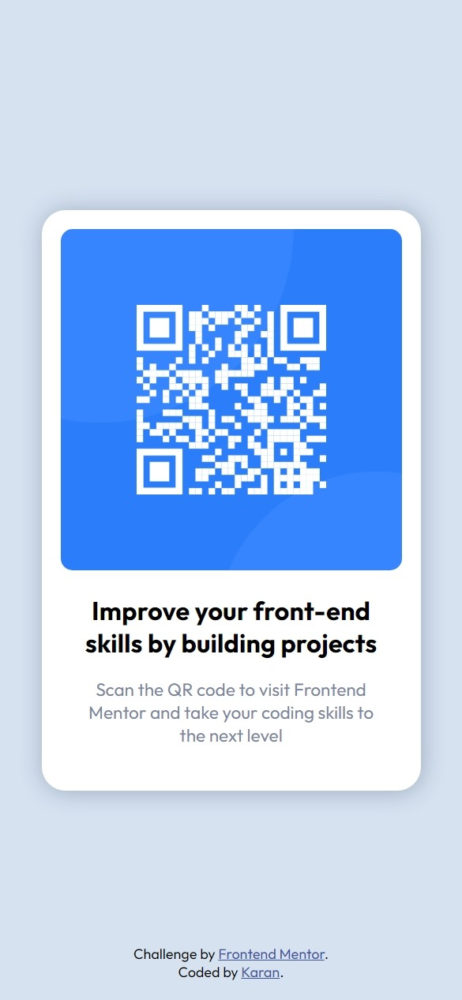

# Frontend Mentor - QR code component solution

This is a solution to the [QR code component challenge on Frontend Mentor](https://www.frontendmentor.io/challenges/qr-code-component-iux_sIO_H). Frontend Mentor challenges help you improve your coding skills by building realistic projects. 

## Table of contents

- [Overview](#overview)
  - [Screenshot](#screenshot)
  - [Links](#links)
- [My process](#my-process)
  - [Built with](#built-with)
- [Author](#author)

## Overview

QR code component- The first and easiest challenge that one can do on Frontend Mentor. I accepted this challenge and present you *my solution* of the challenge.

I made this static website using basic HTML5 and CSS3 as for now that is what I know. I tried my best to be exact in design and I hope you like it.

### Screenshot

  
  
Desktop View

 

  
  
Mobile View

### Links

- Solution Site URL: *[My Solution](https://www.frontendmentor.io/solutions/qr-code-component-JLg0LBRiB_)*
- Live Site URL: *[QR Code Component](https://qr-code-component-karancy.netlify.app/)*

## My process

I started by deciding how many divs I want:
* one for the actual card i.e. the container that'll contain my image and text. {**class="container"**}
  - one image tag for QR code.
  - one h1 tag for main heading.
  - one p tag for summary.
* one for my footer.

Then I used CSS properties to put margin, padding, color, shadows, etc. to style it. Also, I used CSS position properties and Flexbox to center my content.

### Built with

- Semantic HTML5 markup
- CSS custom properties
- Flexbox

## Author

- LinkedIn - [Karan](https://www.linkedin.com/in/karan-2841a919a)
- Frontend Mentor - [@karancy021](https://www.frontendmentor.io/profile/karancy021)
- Twitter - [@Krat0sum](https://twitter.com/Krat0sum)
